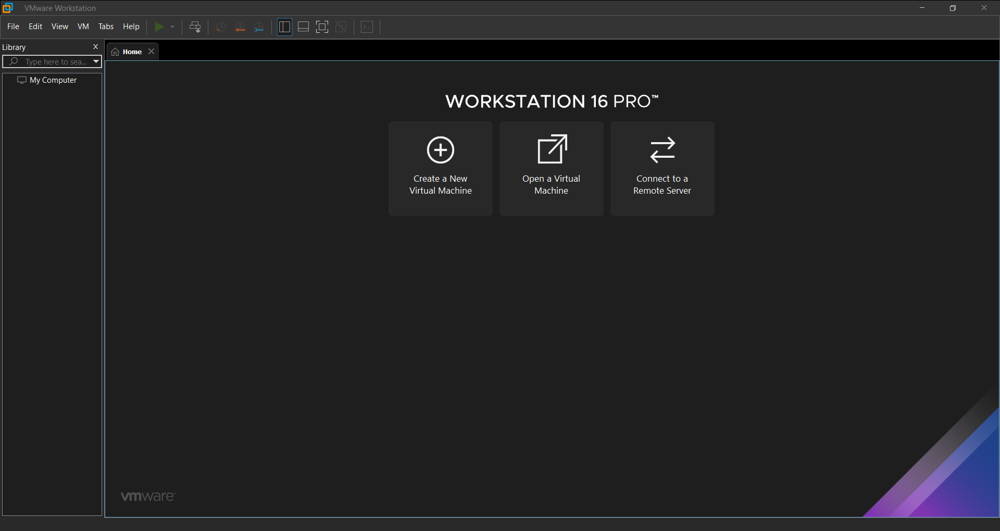
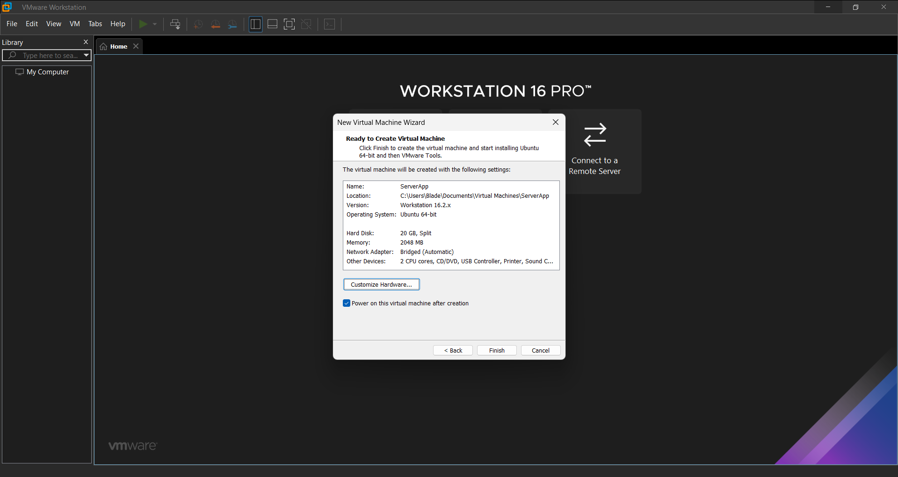
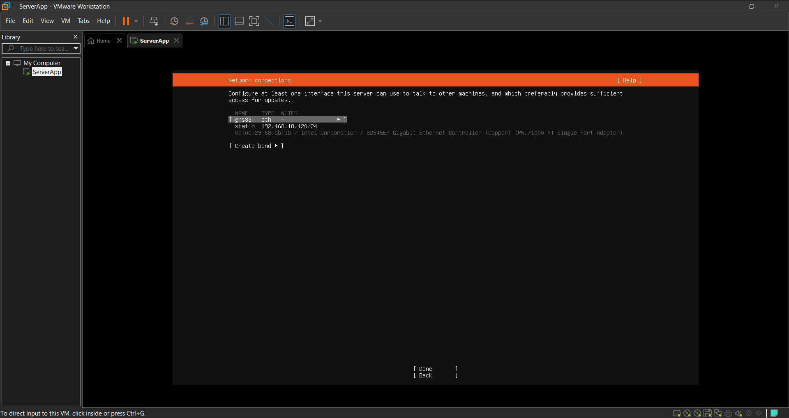
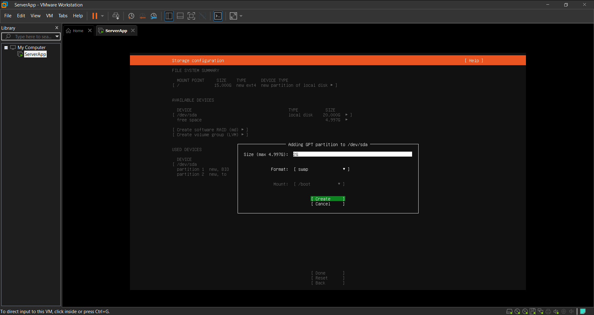
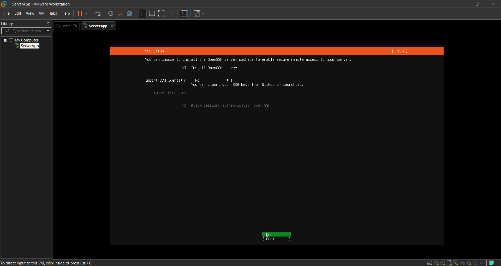
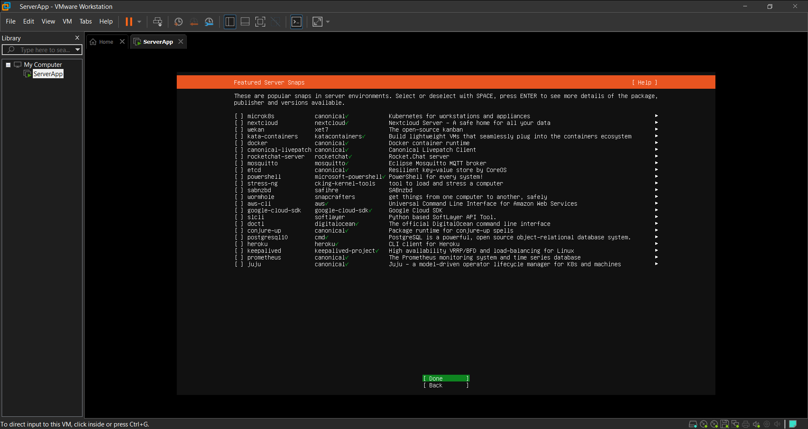
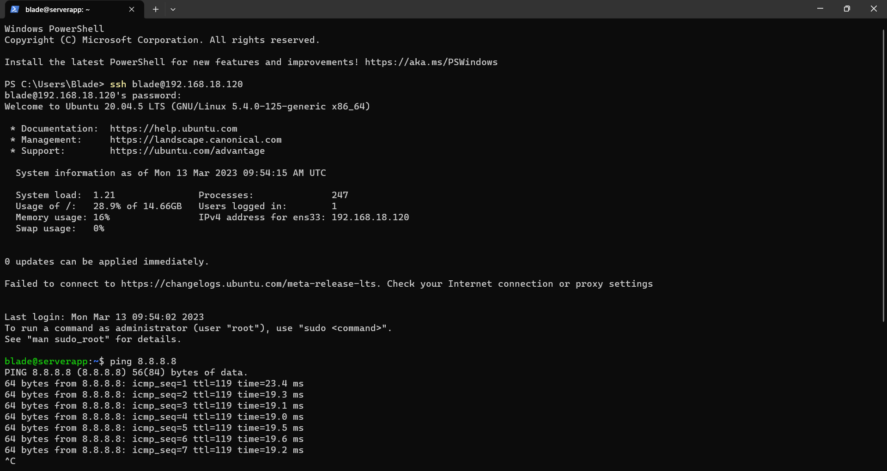

# Introduction to DevOps

## Definisi DevOps
DevOps adalah serangkaian praktik yang mengotomasisasi proses antara pengembangan aplikasi dan tim pengembang agar mereka dapat melakukan proses **_build_**, **_test_** dan **_release_** perangkat lunak lebih cepat dan lebih handal.

## Lifecycle DevOps
- **_Continuous Integration_** : Tim pengembang berkolaborasi satu sama lain untuk mengembangkan  aplikasi.  **_Continuous Integration_** memudahkan pengelolaan kode antar **_developer_**. **_Continuous Integration_** bertujuan untuk otomatisasi, transparansi, dan kolaborasi antara **_developer_** terkait kode yang diproduksi.
- **_Continuous Delivery_** : Dalam **_Continuous Delivery_**, ini terdiri dari fase pengujian dan rilis. **_Continuous Delivery_** dapat membantu memastikan aplikasi siap untuk di **_deploy_** dengan secara otomatis melewati tahap pengujian dan rilis.  
- **_Continuous Deployment_** : Dalam **_Continuous Deployment_** memastikan bahwa publish aplikasi dapat dilakukan tanpa mempengaruhi kinerja dari aplikasi tersebut. Sangat penting untuk memastikan bahwa kode telah diterapkan pada semua server pada fase ini. Proses ini menghilangkan kebutuhan untuk merilis aplikasi secara manual.

## Konsep HyperVisor
Hypervisor adalah sebuah teknik virtualisasi yang memungkinkan beberapa sistem operasi untuk berjalan bersamaan pada sebuah host.

## Operating System
Operating System adalah penghubung antara software dan hardware agar dapat digunakan oleh pengguna.

## Install Ubuntu Server
Sebelum melakukan instalasi ubuntu server, hal pertama yang harus dilakukan adalah menginstall tools virtual machine serta mendownload file ISO ubuntu server terlebih dahulu. Kali ini, akan menggunakan tools VMware Workstation Player sebagai virtual machine. Download [VMware Workstation Player](https://www.vmware.com/asean/products/workstation-player/workstation-player-evaluation.html) dan [ISO Ubuntu Server 20.04](https://ubuntu.com/download/server) 
    

- Setelah melakukan instalasi VMware, buka VmWare. Kemudian klik `“Create a New Virtual Machine”`, Kemudian masukan file ISO Ubuntu yang akan diinstall. Disini pilih saja di bagian `Installer disc image file (iso):`. Dan klik di bagian `Browse` lalu cari lokasi file ISO ubuntu server yang sudah di download sebelumnya lalu klik `Next`.

 
 

- Kemudian masukan user dan password. lalu `Next`.

 

- Kemudian menentukan nama dan lokasi dimana virtual machine akan disimpan.

 

- Setelah itu atur size disk yang ingin digunakan. Disini sebagai contoh saya menggunakan `20GB`. Disini ada 2 pilihan yaitu `Store Disk as a single file` dan `Split virtual disk into multiple files`.
>Store Disk as a single file adalah disk yang di buat itu nantinya akan langsung terbuat 20Gb. (ini tidak disarankan untuk user yang memiliki penyimpanan yang berkapasitas kecil). Split virtual disk into multiple files maksudnya adalah disk yang kita pakai untuk virtual machine kita nantinya itu akan dibagi menjadi beberapa bagian. Jadi walaupun kita menggunakan disk berkapasitas 10Gb itu nanti tidak akan terpakai seluruhnya.

 

- Kemudian Melakukan custom pada hardware. Klik tombol `customize hardware`. Silakan ubah pada bagian Memory ubah menjadi 2GB, lalu processor ubah nilainya menjadi 2-Core CPU dan Network Adapternya pilih Bridged. Disini bisa menyesuaikan dengan kebutuhan. Lalu `Finish`. 

 

- Menunggu proses persiapan instalasi. Kemudian memilih Bahasa dan Layout Keyboard.

 
 

- Kemudian ubah konfigurasi networknya menjadi Manual dan IP Address disesuaikan dengan local network yang terhubung dengan internet.

 
 

-Kemudian proxy setting dan Ubuntu Mirror bisa langsung `Done`.

 
 

- Kemudian pilih `Custom storage layout` dan sesuaikan dengan kebutuhan. lalu `Done` dan `Continue`.

 

-Kemudian profile config diisi dengan keinginan lalu ceklis pada bagian `Install OpenSSH Server` dan setting fitur.

- Kemudian setelah proses instalasi selesai `Reboot`.

- Kemudian Login dengan username dan password yang telah dibuat. lalu memastikan ubuntu sudah terkoneksi pada internet bisa masukan command `ping 8.8.8.8` lalu untuk mengakhiri silahkan tekan ctrl+c.

- Kemudian mencoba remote SSH menggunakan windows Terminal.

