# CI/CD : Jenkins

# Jenkins on Top Docker

- Pertama membuat docker-compose terlebih dahulu. Lalu jalankan dengan docker compose.

```
version: '3.8'
services:
   jenkins:
      image: jenkins/jenkins:lts-jdk11
      container_name: jenkins
      restart: always
      privileged: true
      user: root
      ports:
         - 8080:8080
         - 50000:50000 
      volumes:
         - ~/jenkins:/var/jenkins_home
```


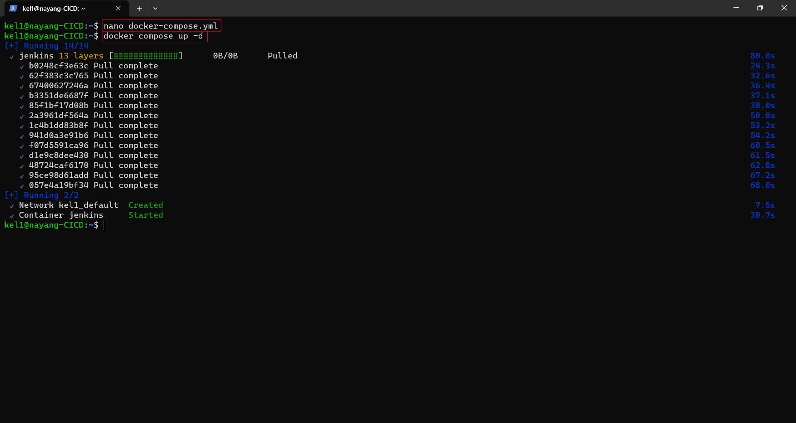

- Pada saat pertama kali akan diminta untuk memasukan password yang sudah di generate secara random oleh jenkins letaknya ada di `/var/jenkins_home/secrets/initialAdminPassword`

- Kemudian masukkan password tersebut untuk bisa mengakses jenkins. pada instalasi plugin pilih `recommend plugin`. Setelah instalasi plugin selesai maka akan diarahkan untuk `Create First Admin User` dan `Instance Configuration`.

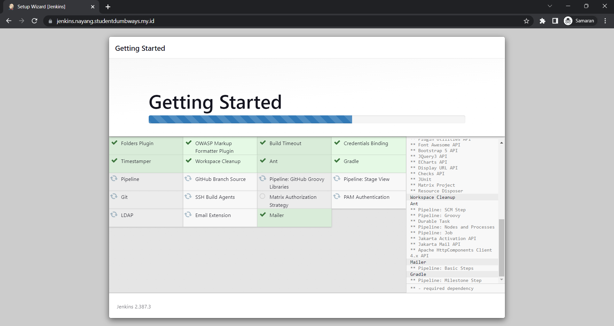

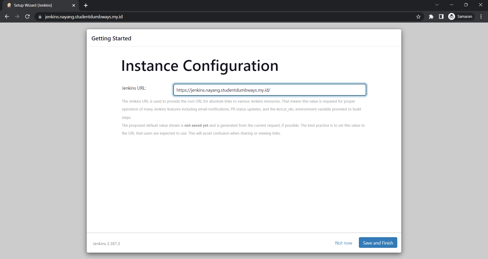

- Dan Jenkins telah siap digunakan.

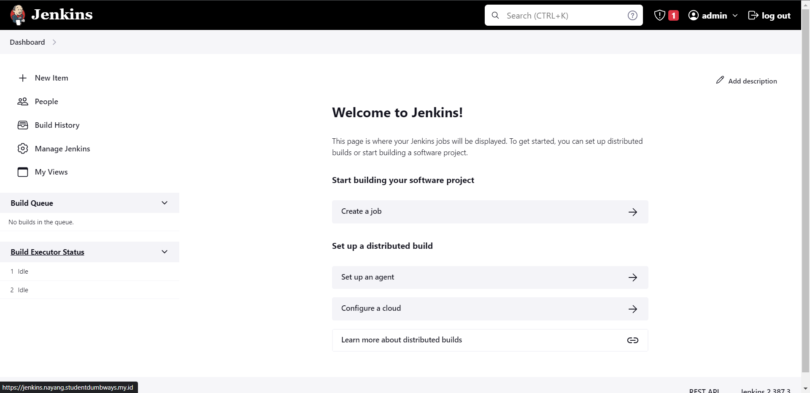

## Menghubungkan Jenkins dengan Server

- Kemudian Konfigurasi ***Manage Credentials***  dan hubungkan Jenkins dengan VPS server dengan menambahkan ssh-keygen.
> - public key dimasukan di dalam authorized keys. 
> - private key diletakan pada ***user Credentials***.


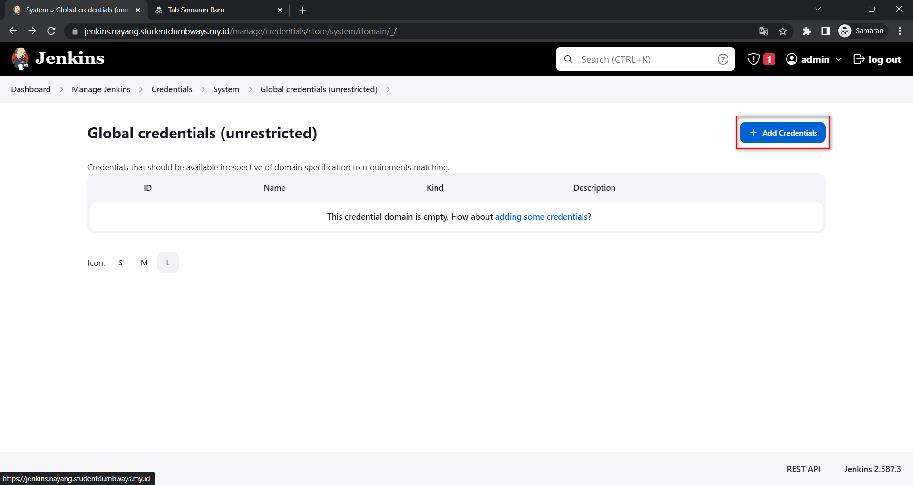

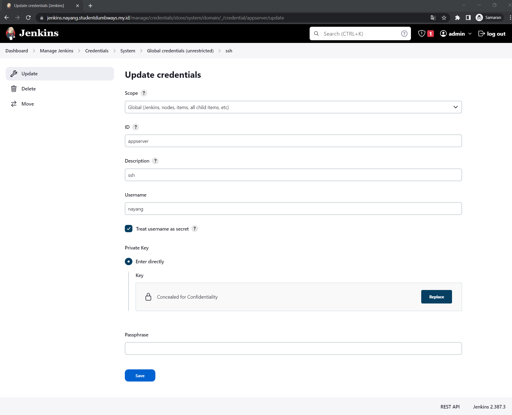

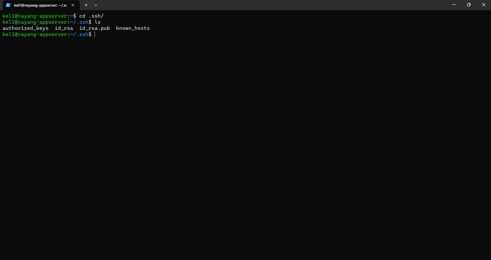

- Kemudian tambahkan plugin ssh pada jenkins agar bisa menggunakan koneksi ssh. 

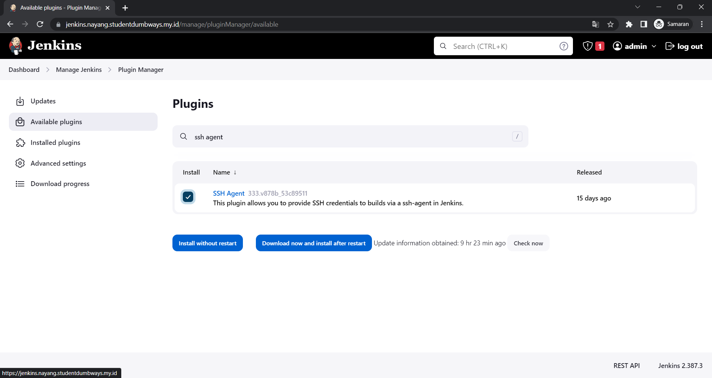

## Membuat Jenkinsfile Frontend dan Backend
- untuk membuat pipeline di butuhkan file bernama `Jenkinsfile`.

`Jenkinsfile Forntend`
```
def branch = "main"
def repo = "https://github.com/myayangs/wayshub-frontend.git"
def cred = "appserver"
def dir = "~/wayshub-frontend"
def server = "kel1@103.13.206.133"
def imagename = "wayshub-fe"
def dockerusername = "myyngstwn"

pipeline {
    agent any

    stages {
        stage('Pull From Repository') {
            steps {
                sshagent([cred]) {
                    sh """ssh -o StrictHostKeyChecking=no ${server} << EOF
                        cd ${dir}
                        git remote add origin ${repo} || git remote set-url origin ${repo}
                        git pull origin ${branch}
                        exit
                        EOF
                    """
                }
            }
        }

    stage('Dockerize') {
            steps {
                sshagent([cred]) {
                    sh """ssh -o StrictHostKeyChecking=no ${server} << EOF
                        cd ${dir}
                        docker build -t ${imagename}:latest .
                        exit
                        EOF
                    """
                }
            }
        }

        stage('Deploy Docker') {
            steps {
                sshagent([cred]) {
                    sh """ssh -o StrictHostKeyChecking=no ${server} << EOF
                        cd ${dir}
                        docker container stop ${imagename}
                        docker container rm ${imagename}
                        docker run -d -p 3000:3000 --name="${imagename}"  ${imagename}:latest
                        docker container stop ${imagename}
                        docker container rm ${imagename}
                        exit
                        EOF
                    """
                }
            }
        }

        stage('Push to Docker Hub') {
            steps {
               sshagent([cred]) {
			    sh """ssh -o StrictHostKeyChecking=no ${server} << EOF
				    docker tag ${imagename}:latest ${dockerusername}/${imagename}:latest
				    docker image push ${dockerusername}/${imagename}:latest
				    docker image rm ${dockerusername}/${imagename}:latest
				    docker image rm ${imagename}:latest
				    exit
                    EOF
			"""
		        }
            }
        }
    }
}
```

`Jenkinsfile Backend`
```
def branch = "main"
def repo = "https://github.com/myayangs/wayshub-backend.git"
def cred = "appserver"
def dir = "~/wayshub-backend"
def server = "kel1@103.13.206.133"
def imagename = "wayshub-be"
def dockerusername = "myyngstwn"

pipeline {
    agent any

    stages {
        stage('Pull From Repository') {
            steps {
                sshagent([cred]) {
                    sh """ssh -o StrictHostKeyChecking=no ${server} << EOF
                        cd ${dir}
                        git remote add origin ${repo} || git remote set-url origin ${repo}
                        git pull origin ${branch}
                        exit
                        EOF
                    """
                }
            }
        }

    stage('Dockerize') {
            steps {
                sshagent([cred]) {
                    sh """ssh -o StrictHostKeyChecking=no ${server} << EOF
                        cd ${dir}
                        docker build -t ${imagename}:latest .
                        exit
                        EOF
                    """
                }
            }
        }

        stage('Deploy Docker') {
            steps {
                sshagent([cred]) {
                    sh """ssh -o StrictHostKeyChecking=no ${server} << EOF
                        cd ${dir}
                        docker container stop ${imagename}
                        docker container rm ${imagename}
                        docker run -d -p 5000:5000 --name="${imagename}"  ${imagename}:latest
                        docker container stop ${imagename}
                        docker container rm ${imagename}
                        exit
                        EOF
                    """
                }
            }
        }

        stage('Push to Docker Hub') {
            steps {
               sshagent([cred]) {
			    sh """ssh -o StrictHostKeyChecking=no ${server} << EOF
				    docker tag ${imagename}:latest ${dockerusername}/${imagename}:latest
				    docker image push ${dockerusername}/${imagename}:latest
				    docker image rm ${dockerusername}/${imagename}:latest
				    docker image rm ${imagename}:latest
				    exit
                    EOF
			"""
		        }
            }
        }
    }
}
```

## Membuat Pipeline
- Kemudian pilih pipeline dan beri nama sesuai aplikasi.

- Masukkan ssh url github, branch dan dll. Hal ini dikarenakan setiap mengalami perubahan, penambahan pada Jenkinsfile harus di add, commit dan push ke akun github yang sudah di setting di server.

- dan kemudian save. Jika Jenkinsfile sudah di tambahkan ke dalam repository. bisa langsung menekan tombol build now. ketika di build bisa melihat error di bagian logs sesuai dengan stage yg di jalankan.

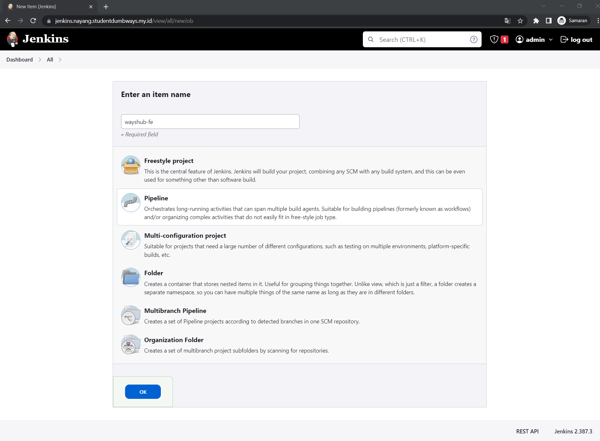

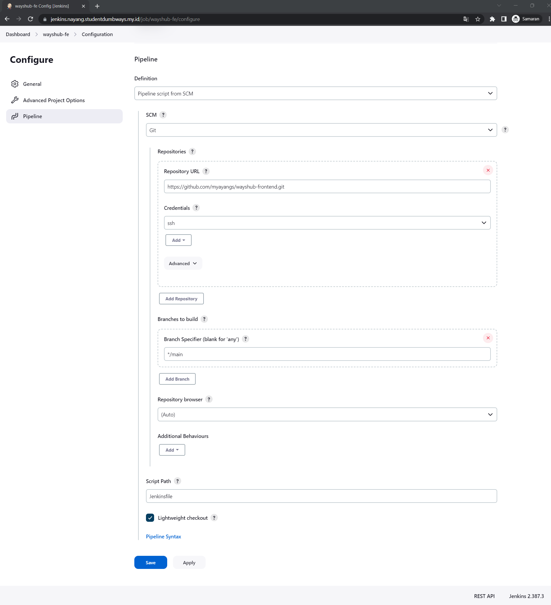

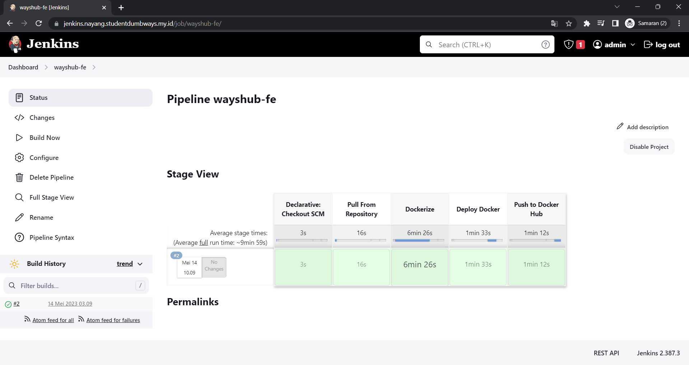


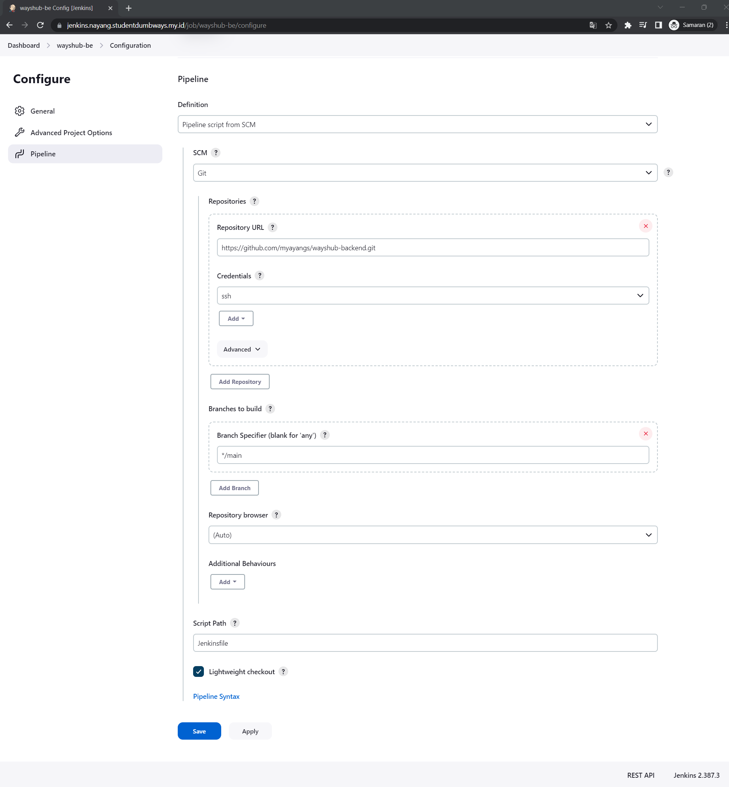

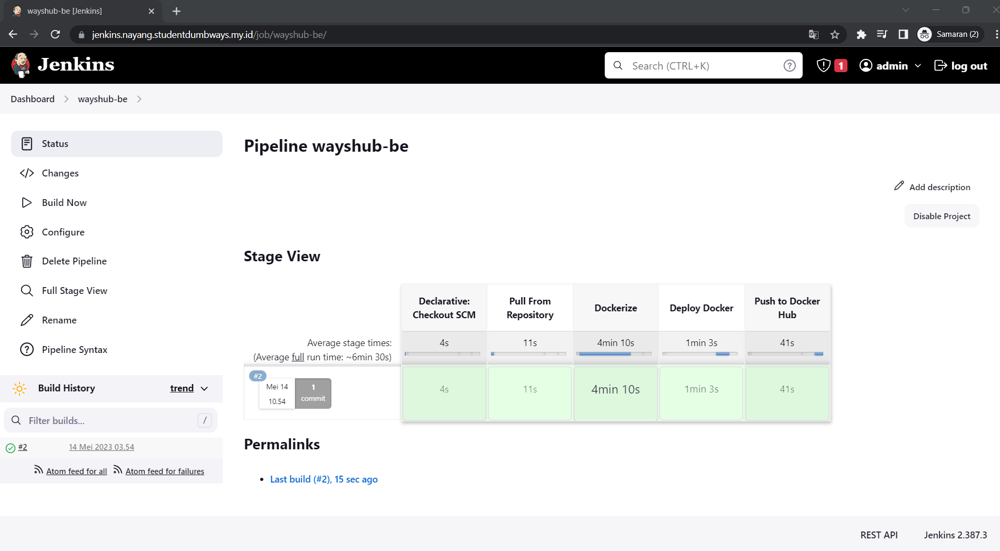

- Berikut aplikasi wayshub-frontend dan wayshub-backend yang telah berhasil di push ke docker hub. 

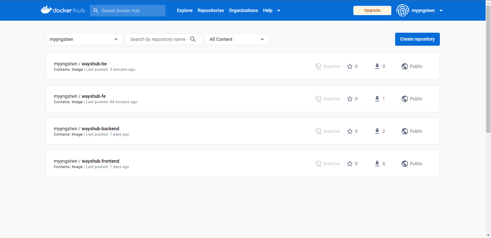

## Konfigurasi Reverse Proxy

- Kemudian membuat reverse proxy dan serta certbot sertifikasi pada aplikasi Jenkins.

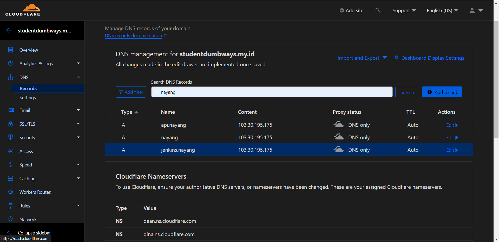

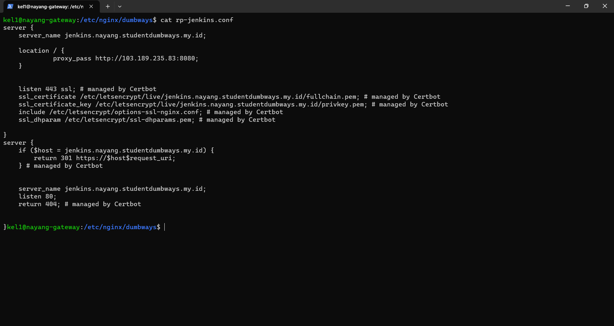