# Ansible

## Setup Ansible

- Install **Ansible**. Lalu cek Ansible sudah terinstall. Bisa gunakan perintah dibawah ini.

```
sudo apt-add-repository ppa:ansible/ansible
```

```
sudo apt install ansible
``` 

```
ansible --version
```

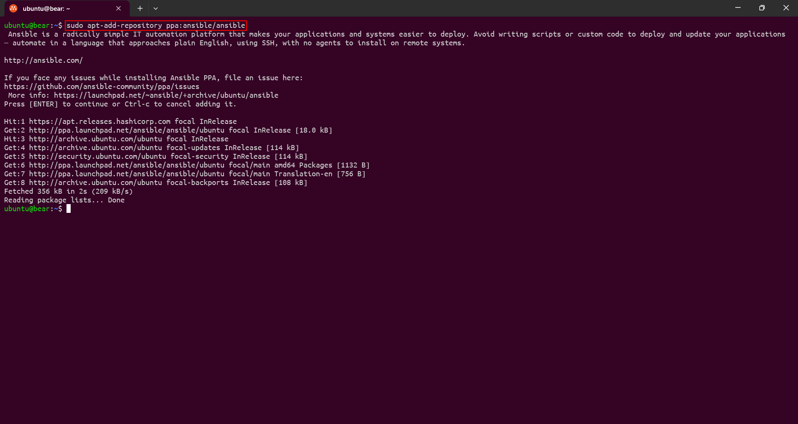

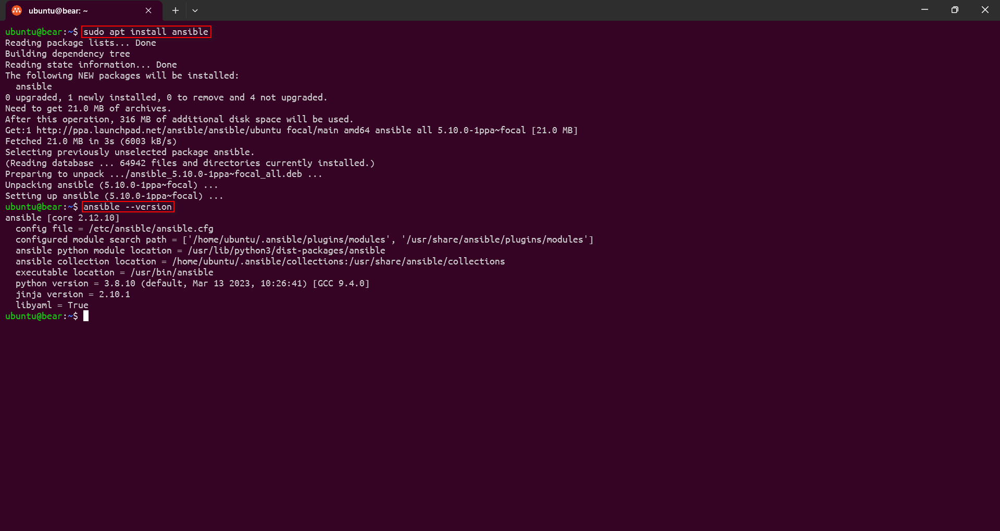

- Kemudian setup konfigurasi dengan membuat file:

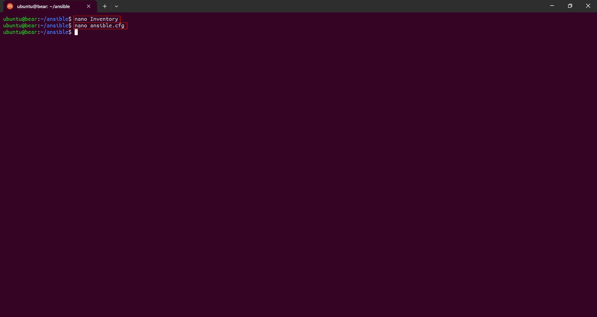

  - `inventory` yang isinya dengan IP dari server yang akan di koneksikan dengan Ansible. 

```
[angka] # name server
123.456.789    # Public IP Address

[all:vars]
ansible_user="" # your username
ansible_pythone_interpreter=/usr/bin/python3
```

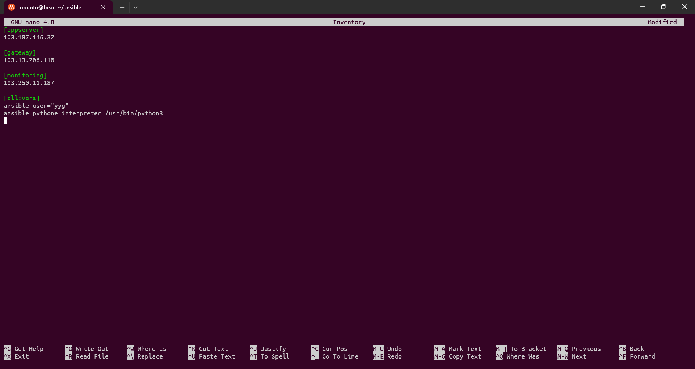

  - `ansible.cfg`  yang isinya dengan konfigurasi dasar Ansible.

```
[defaults]

# target to the inventory file
inventory = Inventory

# used for ansible to access the server with ssh-key
private_key_file = /home/ubuntu/.ssh/id_rsa

# skipping known_hosts checking
host_key_checking = False

# python intrepreter
interpreter_python = auto_silent
```
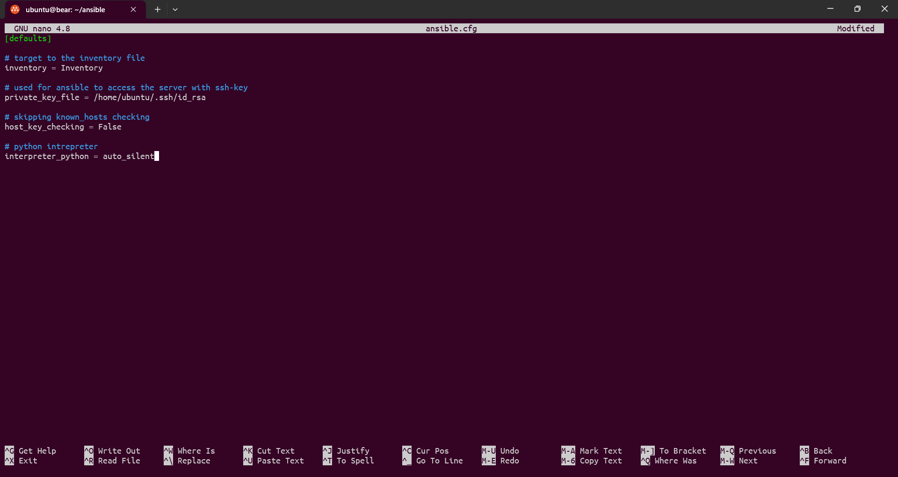

## Create user

- Pertama buat file `add-user.yaml`. Dan isikan konfigurasi seperti dibawah ini.
```
---
- become: true
  gather_facts: false
  hosts: all
  tasks:
    - name: "Creating User"
      ansible.builtin.user:
        groups: sudo
        name: "{{username}}"
        password: "{{password}}"
        state: present
        append: yes
        home: /home/({username})
  vars:
    - username: # Fill in your desired username
    - password:  # whois encrypted password
```

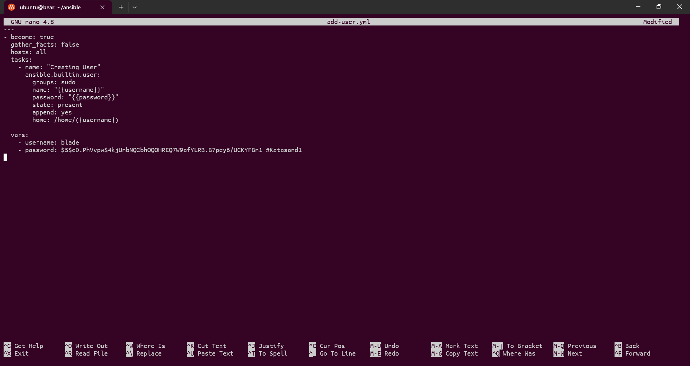

- Untuk password user harus mengisinya dengan password yang sudah di enkripsi, untuk membuat password yang di enkripsi memerlukan package yang bernama `whois`. Install **whois** dan ketikkan password yang akan di enkripsi. Bisa gunakan perintah dibawah ini.

```
sudo apt install whois
```

```
mkpasswd --method=sha-256
```

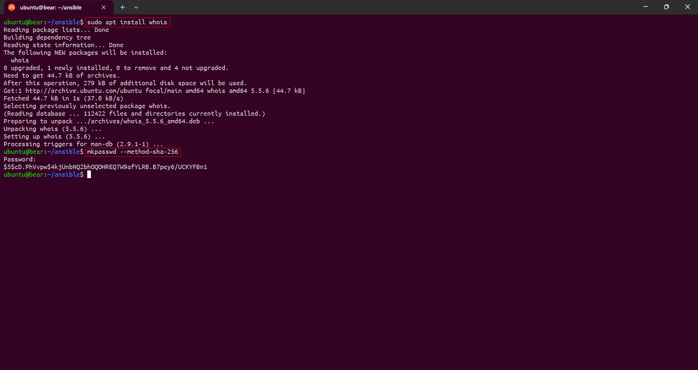

- Setelah mendapatkan password yang sudah di enkripsi, copy password tersebut dan tambahkan kedalam file `add-user.yaml`. Setelah itu jalankan file dengan menggunakan ansible playbook. Bisa gunakan perintah dibawah ini.

```
ansible-playbook add-user.yml
```

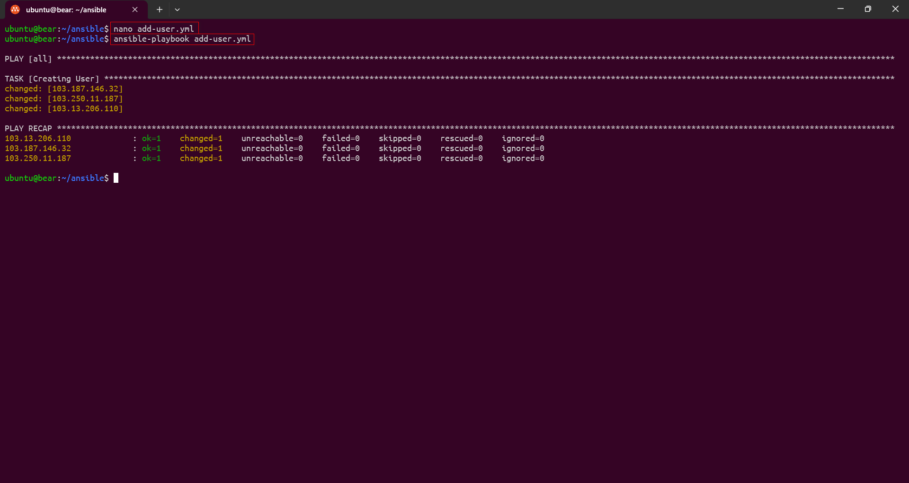


## Setup Docker dan Menjalakan Aplikasi Wayshub Frontend di Appserver

- Pertama buat file `setup-docker.yaml`. Lalu isikan konfigurasi seperti dibawah ini. Dan jalankan file dengan menggunakan ansible playbook. 


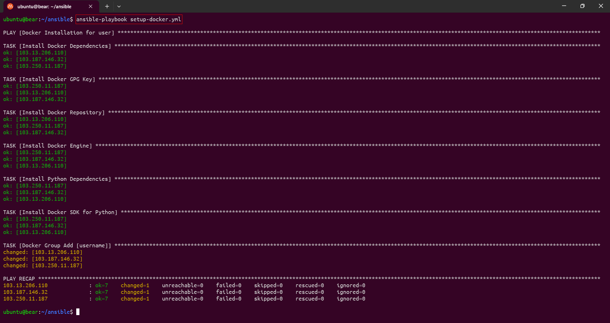

- Kemudian buat file `docker-wayshub.yml`. Lalu isikan konfigurasi seperti dibawah ini. Dan jalankan file dengan menggunakan ansible playbook.

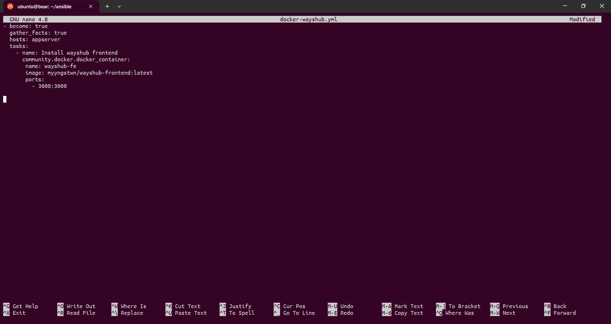

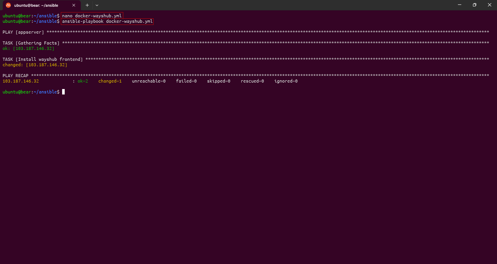

- Wayshub frontend telah berhasil di akses di browser 

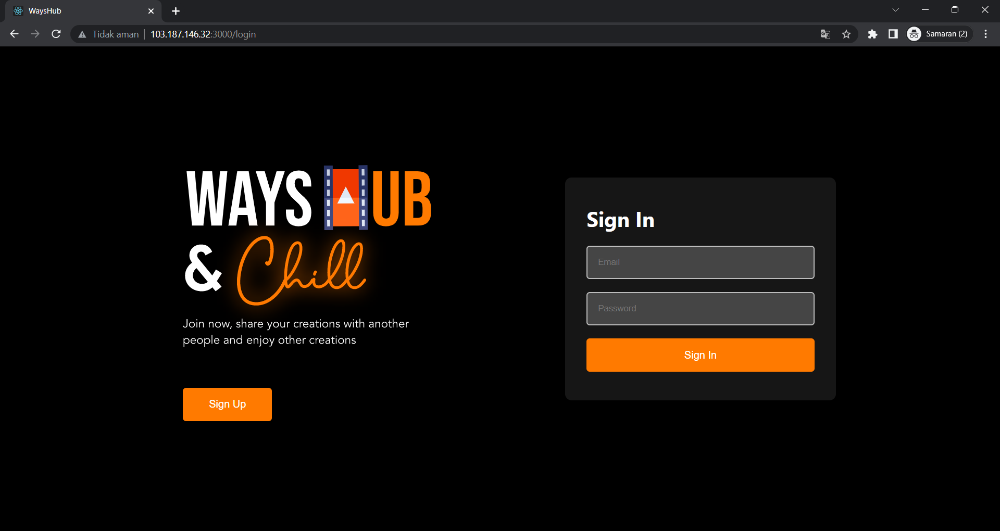

## Setup Nginx

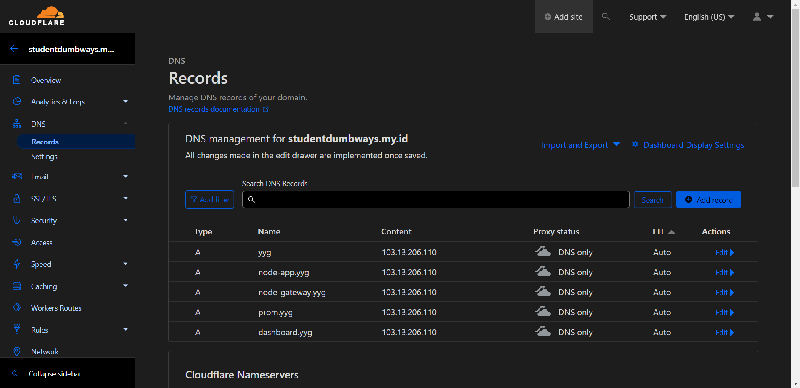
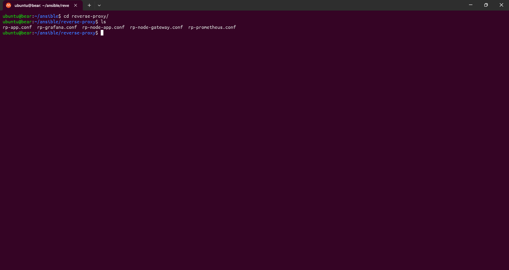
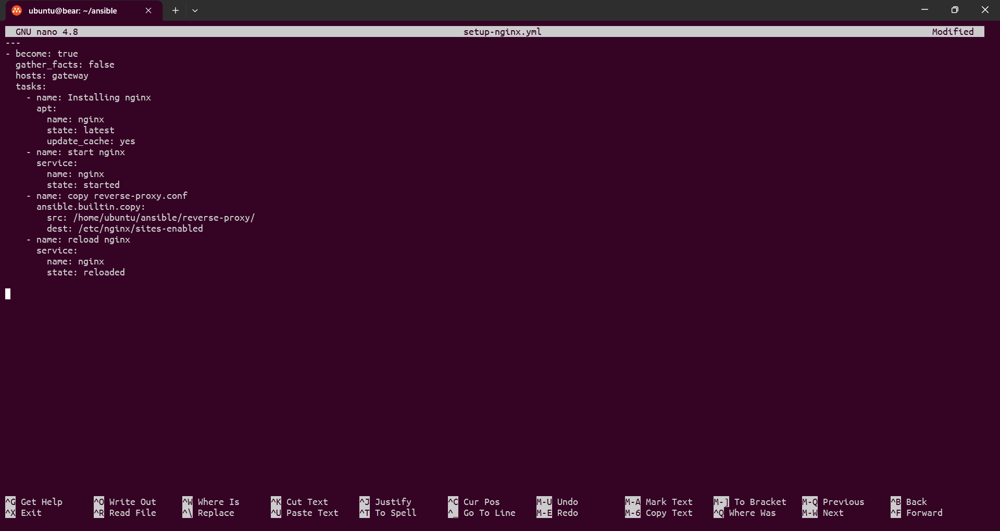
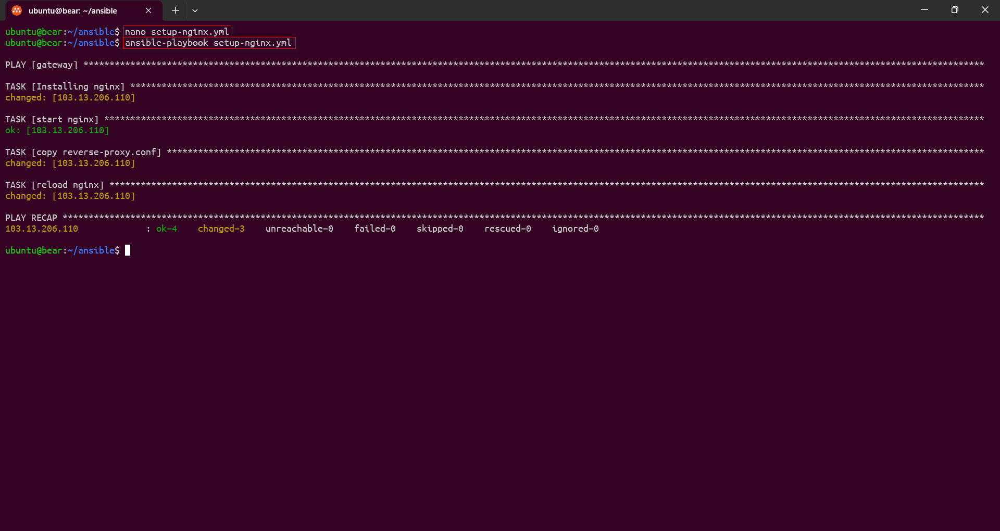
